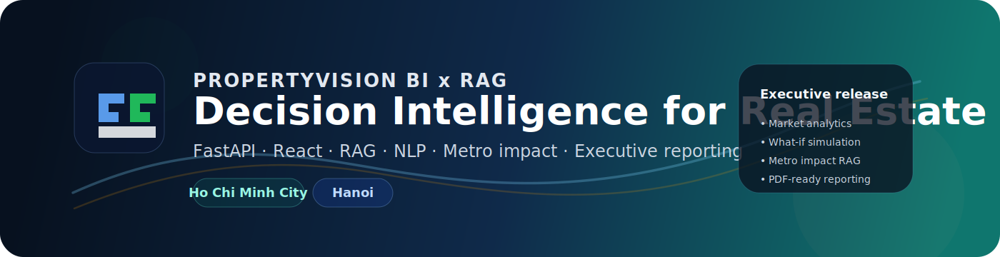
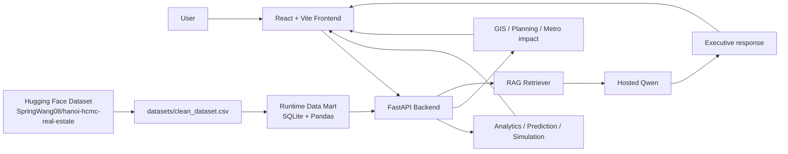

# PropertyVision BI x RAG

<p align="center">
  
</p>

> Executive-grade real-estate decision intelligence for **Ho Chi Minh City** and **Hanoi**.
> BI dashboards, price prediction, what-if simulation, GIS/planning views, and a retrieval-first AI assistant for leadership reporting.

<p align="center">
  <a href="https://github.com/QuangVoAI/PropertyVision/releases/tag/v1.0.0"></a>
  <a href="https://github.com/QuangVoAI/PropertyVision"></a>
  <a href="https://huggingface.co/datasets/SpringWang08/hanoi-hcmc-real-estate"></a>
  <a href="https://huggingface.co"></a>
  <a href="https://github.com/QuangVoAI/PropertyVision"></a>
</p>

<p align="center">
  <a href="https://github.com/QuangVoAI/PropertyVision"></a>
  <a href="https://github.com/QuangVoAI/PropertyVision"></a>
  <a href="https://github.com/QuangVoAI/PropertyVision"></a>
  <a href="https://github.com/QuangVoAI/PropertyVision"></a>
  <a href="https://github.com/QuangVoAI/PropertyVision"></a>
  <a href="https://github.com/QuangVoAI/PropertyVision"></a>
</p>

## Quick Links

- [What You Get](#what-you-get)
- [Quick Start](#quick-start)
- [Environment Variables](#environment-variables)
- [Metro Impact Data](#metro-impact-data)
- [Useful Backend Endpoints](#useful-backend-endpoints)
- [Documentation](#documentation)

## What You Get

- 📊 Executive dashboard with market KPIs and trend views
- 🧩 Multi-dimensional slice-dice analysis
- 📈 Price prediction and ROI simulation
- 🗺️ Planning/GIS map with opportunity and risk views
- 🤖 RAG-based assistant grounded in market, planning, legal, and metro context
- 📝 Export-friendly periodic report view for leadership updates

## At a Glance

| Item | Value |
|---|---|
| Release | `v1.0.0` |
| Main stack | `FastAPI + React + Vite` |
| AI layer | `Hosted Qwen + retrieval-first RAG` |
| Markets covered | `Ho Chi Minh City`, `Hanoi` |
| Metro scope | `Bến Thành`, `Tham Lương`, `HCMC TOD`, `Hanoi TOD` |
| Primary dataset | `datasets/clean_dataset.csv` |

## Architecture



## Repository Layout

```text
PropertyVision/
├── backend/             FastAPI app, analytics, RAG, metro/planning data
├── frontend/            React + Vite UI
├── datasets/            Processed dataset, dataset notes, cached reference data
├── docs/                Diagrams, baseline notes, demo scripts, UI spec
├── data/                SQLite runtime artifacts
├── README.md           Project overview and setup
└── requirements.txt    Python dependencies
```

## Data Model

The application works with a processed dataset and runtime-generated analytical layers:

- `datasets/clean_dataset.csv` is the main processed dataset
- `data/*.db` is created at runtime for facts, planning zones, legal notes, and metro impact profiles
- the backend also builds a cached street-level reference for richer RAG answers

### Automatic dataset behavior

On first backend start, the app will try to:

1. download the processed dataset from Hugging Face
2. store it locally as `datasets/clean_dataset.csv`
3. fall back to the local file if it already exists
4. fall back to raw reference data in `datasets/raw/` if needed

This means a fresh clone can usually start without manual data copying.

Dataset links:

- https://huggingface.co/datasets/SpringWang08/hanoi-hcmc-real-estate
- https://huggingface.co/datasets/tinixai/vietnam-real-estates

## Quick Start

### 1. Clone

```bash
git clone https://github.com/QuangVoAI/PropertyVision.git
cd PropertyVision
```

### 2. Set up the backend

macOS / Linux:

```bash
python -m venv .venv
source .venv/bin/activate
pip install -r requirements.txt
uvicorn backend.main:app --reload
```

Windows PowerShell:

```powershell
python -m venv .venv
.venv\Scripts\Activate.ps1
pip install -r requirements.txt
uvicorn backend.main:app --reload
```

Backend URL:

```text
http://localhost:8000
```

### 3. Set up the frontend

```bash
cd frontend
npm install
npm run dev
```

Frontend URL:

```text
http://localhost:5173
```

## Environment Variables

The app works in retrieval-only mode without a hosted LLM token, but you can enable hosted generation for richer analysis.

Recommended variables:

```bash
HF_TOKEN=your_hugging_face_token
PROPERTYVISION_HF_QWEN_MODEL=Qwen/Qwen2.5-1.5B-Instruct
PROPERTYVISION_HF_INFERENCE_PROVIDER=auto
PROPERTYVISION_USE_HOSTED_QWEN=true
```

Optional `.env` file at the project root is supported.

### Notes

- If no hosted model is available, the app still runs with retrieval-backed analysis.
- If you want faster local debugging with less AI overhead, keep the hosted model disabled.

## Core Features

### 1. 📌 Tổng quan điều hành

- KPI trọng yếu
- xu hướng điều hành dài hạn
- kiểm tra giả định tăng trưởng
- khuyến nghị dành cho ban điều hành

### 2. 🏙️ Thông tin thị trường

- so sánh khu vực
- mặt bằng giá
- phân tích phân khúc
- insight theo thành phố / quận / loại tài sản

### 3. 🔎 Phân tích đa chiều

- slice-dice theo khu vực và phân khúc
- bảng phân đoạn tiềm năng cao
- xem danh sách địa chỉ theo từng record

### 4. 📊 Mô phỏng đầu tư

- giá trị tương lai
- lợi nhuận vốn
- ROI tích lũy
- thời gian hoàn vốn
- khuyến nghị mua thêm / giữ / bán bớt

### 5. 🗺️ Bản đồ quy hoạch

- opportunity score
- risk level
- bộ lọc theo ROI, score và rủi ro
- dữ liệu quy hoạch, legal, và metro impact

### 6. 🤖 Trợ lý phân tích

- hỏi đáp theo ngữ cảnh RAG
- nguồn trích dẫn rõ ràng
- khuyến nghị ngắn gọn theo giọng điều hành

### 7. 📝 Báo cáo định kỳ

- bản tóm tắt kiểu executive report
- hỗ trợ in ra PDF từ trình duyệt

## Metro Impact Data

The backend now includes a dedicated metro-impact layer for real estate analysis:

- Ho Chi Minh City metro line 1
- Ben Thanh central station
- Tham Luong station / metro line 2 gateway
- Hanoi TOD and urban rail corridor references

This layer is available through the RAG pipeline and the data-ops view so the assistant can answer questions like:

- “Metro ảnh hưởng giá nhà như thế nào?”
- “Bến Thành và Tham Lương tác động ra sao?”
- “Hà Nội và TP.HCM khác nhau thế nào quanh ga metro?”

There is also an API endpoint:

```text
GET /api/metro/impact
```

## Refreshing Data

If you change planning, legal, metro, or market sources, refresh the runtime layers:

```text
POST /api/etl/run
POST /api/rag/reindex
```

You can also use the **Theo dõi dữ liệu** page in the UI to do this.

## Useful Backend Endpoints

- `GET /api/metadata`
- `POST /api/analytics`
- `POST /api/slice-dice`
- `POST /api/predict`
- `POST /api/what-if`
- `GET /api/map/districts`
- `GET /api/planning/zones`
- `GET /api/metro/impact`
- `POST /api/rag/reindex`
- `GET /api/etl/status`
- `GET /api/ai/status`

## Notes For Contributors

- The repository is designed so that a new clone can run end-to-end with minimal manual setup.
- Avoid committing generated runtime files from `data/` and downloaded dataset artifacts unless intentional.
- If you update the dataset or knowledge base, reindex RAG so the assistant reflects the latest state.

## 📚 Documentation

- [Project Diagrams](docs/PROJECT_DIAGRAMS.md)
- [Technical Baseline](docs/BASELINE.md)
- [Demo Script](docs/DEMO_SCRIPT.md)
- [UI Design Spec](docs/UI_DESIGN_SPEC.md)

## 🎁 Release Notes

- Official `v1.0.0` release for executive-grade real-estate intelligence.
- Adds a cleaner onboarding README so new contributors can clone and run faster.
- Includes metro-impact data and RAG coverage for Ho Chi Minh City and Hanoi.
- Keeps the AI experience retrieval-first, with hosted Qwen available when configured.

## 🪪 License / Data Use

This project aggregates public, processed, and derivative analytical data for BI and demonstration purposes.
Please review the source terms of any upstream data before redistribution or commercial use.
