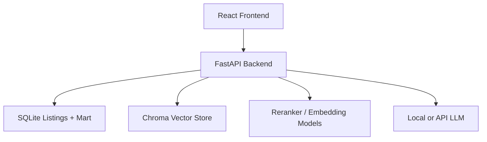
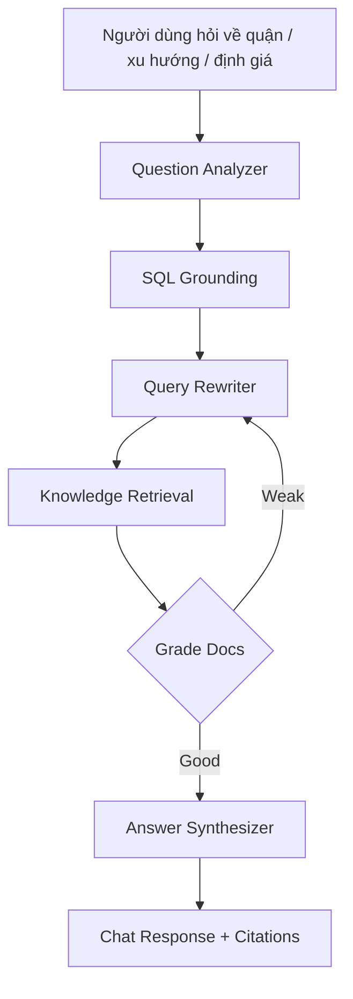

# ProPropertyVision

Web-first project cho demo bất động sản: SQLite mart, FastAPI backend, React data visualization dashboard,
forecasting what-if, và Agentic RAG từ tài liệu quy hoạch.

## Quick Start

```bash
python3 -m venv .venv
source .venv/bin/activate
pip install -r requirements.txt
python -m src.generate_sample
uvicorn backend.main:app --reload
```

Mở terminal khác cho frontend:

```bash
cd frontend
npm install
npm run dev
```

Sau đó truy cập:

- Frontend: `http://127.0.0.1:5173`
- Backend API: `http://127.0.0.1:8000`
- Swagger docs: `http://127.0.0.1:8000/docs`

Nếu mạng yếu và bạn chưa muốn cài full RAG stack ngay, backend vẫn có thể chạy với fallback TF-IDF khi thiếu:

- `chromadb`
- `sentence-transformers`
- `openai`

## Dùng Dataset Kaggle Thật

Nguồn bạn chọn:

- HCM: https://www.kaggle.com/datasets/lammike/vietnam-housing-hcm
- Hà Nội: https://www.kaggle.com/datasets/ladcva/vietnam-housing-dataset-hanoi

Theo metadata công khai của Kaggle, dataset Hà Nội có file `VN_housing_dataset.csv` với `13` cột; dataset HCM mô tả các trường như `Location`, `Price`, `Type of House`, `Land Area`, `Bedrooms`, `Toilets`, `Total Floors`, `Legal Documents`.

Quy trình:

```bash
mkdir -p data/raw
# tải 2 file csv từ Kaggle rồi đặt tên:
# data/raw/vietnam_housing_hcm.csv
# data/raw/VN_housing_dataset.csv
python -m src.ingest_kaggle
uvicorn backend.main:app --reload
```

Nếu chưa có CSV thật, bạn vẫn có thể chạy:

```bash
python -m src.generate_sample
uvicorn backend.main:app --reload
```

## Current Scope

- `src/generate_sample.py`: sinh dữ liệu giả lập cho TP.HCM và Hà Nội
- `src/ingest_kaggle.py`: chuẩn hóa 2 dataset Kaggle HCM/Hà Nội vào schema chung
- `src/etl.py`: chuẩn hóa giá như `2 tỷ 5`, `500 triệu`
- `src/db.py`: tạo schema SQLite
- `src/analytics.py`: trend forecast, confidence band, what-if simulator, undervalued detection
- `src/query_engine.py`: tóm tắt SQL theo câu hỏi người dùng
- `src/rag.py`: vector retrieval với ChromaDB, reranker, LLM generation và TF-IDF fallback
- `src/agentic_rag.py`: pipeline RAG nhiều bước theo kiểu analyze -> rewrite -> retrieve -> grade -> answer
- `src/data_access.py`: data loading và filter dùng chung cho backend
- `src/pipeline.py`: helper nạp synthetic hoặc Kaggle từ app
- `backend/main.py`: FastAPI endpoints cho dashboard, scenario, chat, RAG ops
- `frontend/`: React/Vite web dashboard và chat UI

## Web Architecture



Frontend tập trung vào:

- dashboard data visualization
- filter/state management
- forecast controls
- chat experience

Backend tập trung vào:

- SQL/data mart query
- forecast logic
- undervalued detection
- Agentic RAG
- reindex vector store

## Dashboard Features

- Sidebar filter theo thành phố, quận/huyện, loại nhà
- Web sidebar để lọc dữ liệu, nạp synthetic/Kaggle, và rebuild RAG index
- Overview:
  - KPI tổng quan
  - Map giá theo quận
  - Chuỗi thời gian giá trung bình
  - Scorecard quận đáng chú ý
- Data:
  - District scorecard
  - Listings explorer
- Forecast:
  - Trend line + confidence band
  - What-if simulator với 3 preset demo:
    - `Đóng băng`
    - `Ổn định`
    - `Sốt đất hạ tầng`
  - Bảng `Undervalued Detection`
- Chat:
  - Agentic RAG flow: query analysis, SQL grounding, query rewrite, retrieval, doc grading, answer synthesis
  - Câu trả lời kết hợp SQL summary + planning context từ thư mục `knowledge/`
  - Hiển thị citation file nguồn

## Enhanced RAG Stack

Phiên bản mạnh hơn hiện hỗ trợ 3 lớp:

- `Vector DB`: `ChromaDB` lưu chunk embeddings từ thư mục `knowledge/`
- `Reranker`: `CrossEncoder` từ `sentence-transformers` để lọc context mạnh hơn
- `LLM Generation`: ưu tiên `Qwen 2.5 14B local` qua Ollama; nếu không có thì có thể dùng `OpenAI`; nếu vẫn không có thì app tự fallback sang template grounded answer

Environment tùy chọn:

```bash
export LOCAL_LLM_PROVIDER=ollama
export OLLAMA_BASE_URL=http://127.0.0.1:11434
export OLLAMA_MODEL=qwen2.5:14b
export OPENAI_API_KEY=your_key
export OPENAI_MODEL=gpt-4o-mini
export RAG_EMBED_MODEL=sentence-transformers/paraphrase-multilingual-MiniLM-L12-v2
export RAG_RERANK_MODEL=BAAI/bge-reranker-v2-m3
```

Nếu bạn đang chạy `Qwen 2.5 14B` local bằng Ollama:

```bash
ollama serve
ollama list
```

Backend sẽ tự thử gọi:

- `POST http://127.0.0.1:11434/api/chat`
- model mặc định: `qwen2.5:14b`

Nếu muốn dùng local endpoint kiểu OpenAI-compatible thay vì Ollama:

```bash
export LOCAL_LLM_PROVIDER=openai_compat
export OPENAI_COMPAT_BASE_URL=http://127.0.0.1:8000/v1
export OPENAI_COMPAT_MODEL=Qwen/Qwen2.5-14B-Instruct
export OPENAI_COMPAT_API_KEY=EMPTY
```

Sau khi thêm tài liệu vào `knowledge/`, mở app và bấm `Build Vector Index` ở sidebar.

## API Endpoints

- `GET /api/health`
- `GET /api/meta`
- `GET /api/dashboard`
- `POST /api/forecast/scenario`
- `POST /api/chat`
- `POST /api/data/load-sample`
- `POST /api/data/load-kaggle`
- `POST /api/rag/reindex`
- `DELETE /api/rag/index`

## Agentic RAG Cho Đề Tài Bất Động Sản

Kiểu kiến trúc này được điều chỉnh từ mô hình RAG nhiều bước sang bài toán tư vấn đầu tư:



Ý nghĩa theo đề tài:

- `Question Analyzer`: nhận diện người dùng đang hỏi `giá`, `xu hướng`, hay `định giá thấp`.
- `SQL Grounding`: lấy số liệu thật từ listings và mart tháng.
- `Query Rewriter`: đổi câu hỏi người dùng sang ngôn ngữ truy hồi như `quy hoạch`, `hạ tầng`, `đầu tư`.
- `Knowledge Retrieval`: tìm đoạn liên quan trong thư mục `knowledge/`.
- `Grade Docs`: loại bớt tài liệu retrieval kém liên quan.
- `Answer Synthesizer`: gộp dữ liệu giá với context quy hoạch để tạo câu trả lời thuyết phục hơn.

## Demo Flow Gợi Ý

1. Mở web dashboard để cho thấy quy mô dữ liệu, giá trung bình và bản đồ điểm nóng.
2. Chuyển xuống phần `Forecast Canvas`, chọn một quận cụ thể và đổi preset từ `Ổn định` sang `Đóng băng` hoặc `Sốt đất hạ tầng`.
3. Mở `RAG Analyst` và hỏi kiểu:
   - `Quận 7 có đáng đầu tư không?`
   - `Khu nào đang rẻ tương đối theo z-score?`
   - `Xu hướng giá ở Cầu Giấy như thế nào?`
4. Nếu mạng yếu hoặc CSV Kaggle chưa sẵn, dùng nút `Load Synthetic Data` trong sidebar để chạy fallback.

## Lưu Ý

- Import Kaggle chỉ được kiểm thử cú pháp ở repo hiện tại; để xác nhận mapping cột cuối cùng, bạn cần đặt đúng 2 file CSV thật vào `data/raw/`.
- Thư mục `knowledge/` hiện dùng file `.md` để mô phỏng planning documents. Bạn có thể thay bằng nội dung trích xuất từ PDF Savills/CBRE để tăng chất lượng phần giải thích.
- Frontend chưa được build test trong repo hiện tại vì chưa cài `node_modules`; sau `npm install`, chạy `npm run dev` để kiểm tra end-to-end.
