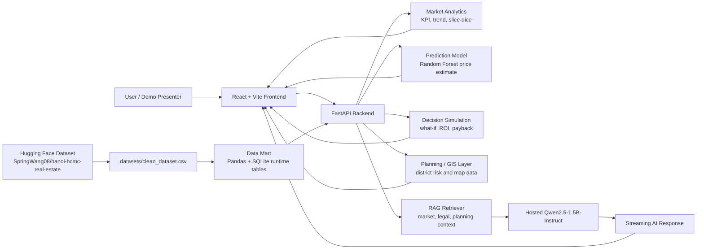
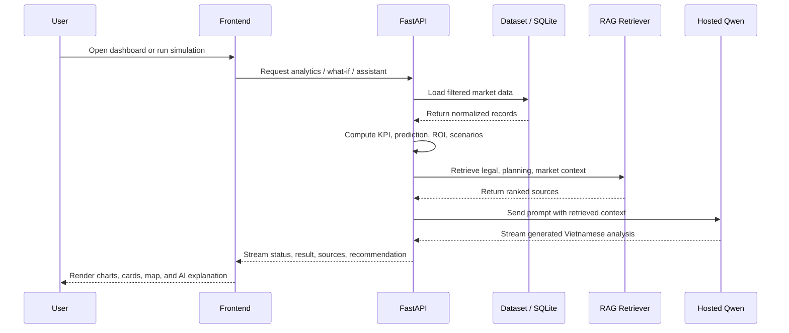

# PropertyVision BI

PropertyVision BI is a full-stack real estate intelligence application for **Ho Chi Minh City** and **Hanoi**, built for business intelligence, price prediction, ROI analysis, planning-risk exploration, and executive-style decision support.

The project combines:

- a **FastAPI backend** for analytics, prediction, planning, and assistant endpoints
- a **React + Vite frontend** for dashboards and interactive exploration
- a **Hugging Face-hosted processed dataset** that can be pulled automatically on first backend run

## Highlights

- Unified analytics across **Ho Chi Minh City** and **Hanoi**
- Market KPIs, district comparison, and property-type breakdowns
- Price prediction with machine learning
- What-if simulation and future recommendation flows
- GIS and planning-oriented views
- Retrieval-first assistant with hosted Qwen text generation

## Project Structure

```text
PropertyVision/
├── backend/                    FastAPI application
├── frontend/                   React + Vite frontend
├── datasets/                   Local dataset workspace
│   ├── README.md               Dataset card / dataset notes
│   └── raw/                    Optional raw reference files
├── data/                       SQLite files generated at runtime
├── docs/                       Project documentation
├── notebooks/                  Data exploration notebooks
├── app.py                      Quick run note
├── README.md
└── requirements.txt
```

## Architecture Diagram



## Data And AI Flow



More detailed diagrams are available in [Project Diagrams](docs/PROJECT_DIAGRAMS.md).

## Dataset Behavior

The application is configured so that **cloning the repository is enough to get started**.

When the backend starts:

1. it tries to download `clean_dataset.csv` from Hugging Face
2. it stores the file locally at:

```text
datasets/clean_dataset.csv
```

3. if the download is unavailable but `datasets/clean_dataset.csv` already exists, it uses that local file
4. if neither is available, it falls back to the raw reference CSV files in `datasets/raw/`
5. when the AI assistant needs more granular street-level context, the backend can also build a cached supplementary street reference from `tinixai/vietnam-real-estates` into:

```text
datasets/.cache/street_market_reference.csv
```

Hugging Face dataset:

- https://huggingface.co/datasets/SpringWang08/hanoi-hcmc-real-estate
- https://huggingface.co/datasets/tinixai/vietnam-real-estates

The supplementary street-level source is used as a retrieval reference layer for richer AI recommendations. Please review and keep its original license terms when publishing or redistributing derivative outputs.

This means a fresh clone can run without manually copying the processed dataset into the repo.

## Data Quality Note

The processed CSV is not a raw export. Before the backend serves it, the app applies a rule-based normalization pass so the dataset stays internally consistent and demo-ready:

- `Bedrooms`, `Toilets`, and `Total Floors` are normalized by property type, area, and floor count
- land-type records are forced to `0` bedrooms, `0` toilets, and `0` floors
- Hanoi locations are aligned to real wards, communes, and townships within the correct districts
- dates are constrained to a realistic analysis window so trend charts remain meaningful

These rules are designed for BI exploration and portfolio demos, not as a claim of ground-truth property labels.

## Quick Start

### 1. Clone the repository

```bash
git clone https://github.com/QuangVoAI/PropertyVision.git
cd PropertyVision
```

### 2. Start the backend

macOS / Linux:

```bash
python -m venv .venv
source .venv/bin/activate
pip install -r requirements.txt
uvicorn backend.main:app --reload
```

Windows PowerShell:

```powershell
python -m venv .venv
.venv\Scripts\Activate.ps1
pip install -r requirements.txt
uvicorn backend.main:app --reload
```

Backend:

```text
http://localhost:8000
```

### 3. Start the frontend

```bash
cd frontend
npm install
npm run dev
```

Frontend:

```text
http://localhost:5173
```

## First-Run Experience

On the first backend run, the app may spend a short moment downloading the processed dataset from Hugging Face into `datasets/clean_dataset.csv`.

If you open the AI assistant and ask for detailed recommendations by ward or street, the backend may also take an extra moment on the first run to build the street-level cache for Hanoi and Ho Chi Minh City.

After that:

- the file remains available locally
- subsequent backend runs reuse the downloaded file
- the street-level cache in `datasets/.cache/` is reused for later AI requests
- the repository stays clean because the downloaded dataset file is ignored by Git

## AI / RAG Mode

PropertyVision uses a retrieval-first AI flow:

- RAG retrieves relevant market, planning, and legal context from the local knowledge base
- the knowledge base now includes ward-level and supplementary street-level market notes for Hanoi and Ho Chi Minh City
- Qwen2.5-1.5B-Instruct is used as a hosted language layer to rewrite those retrieved facts into smoother executive-style analysis
- if the hosted model is unavailable or times out, the app surfaces a clear AI error state so the demo does not silently change behavior

### Default Mode

The backend runs in hosted-Qwen mode by default, with a short timeout. This is enough for demo and portfolio use when you have internet access and a valid Hugging Face token.

### Hosted Qwen Setup

Set your Hugging Face token and, if needed, override the model or provider:

macOS / Linux:

```bash
export HF_TOKEN=your_hugging_face_token
export PROPERTYVISION_HF_QWEN_MODEL=Qwen/Qwen2.5-1.5B-Instruct
export PROPERTYVISION_HF_INFERENCE_PROVIDER=auto
uvicorn backend.main:app --reload
```

Windows PowerShell:

```powershell
$env:HF_TOKEN="your_hugging_face_token"
$env:PROPERTYVISION_HF_QWEN_MODEL="Qwen/Qwen2.5-1.5B-Instruct"
$env:PROPERTYVISION_HF_INFERENCE_PROVIDER="auto"
uvicorn backend.main:app --reload
```

You can also place the same variables in a local `.env` file at the project root. The backend reads `.env` automatically on startup.

If you want to disable hosted generation and keep the app in retrieval-only analysis mode for debugging, set:

```bash
export PROPERTYVISION_USE_HOSTED_QWEN=false
```

If the hosted model does not respond in time, the UI will show a clear error state instead of silently switching to a different language layer.

### Refresh RAG Index

If you update planning, legal, or analytical sources and want the AI layer to rebuild its retrieval index, call:

```bash
POST /api/rag/reindex
```

In the UI, this is exposed through the data operations page.

## Key Files

- `backend/main.py`: primary backend entrypoint
- `frontend/src/main.jsx`: main frontend app
- `datasets/README.md`: local dataset card and dataset notes
- `docs/BASELINE.md`: technical baseline
- `docs/DEMO_SCRIPT.md`: guided demo flow
- `docs/PRESENTATION_OUTLINE.md`: presentation structure
- `docs/UI_DESIGN_SPEC.md`: UI design reference

## Documentation

- [Project Diagrams](docs/PROJECT_DIAGRAMS.md)
- [Technical Baseline](docs/BASELINE.md)
- [Demo Script](docs/DEMO_SCRIPT.md)
- [Presentation Outline](docs/PRESENTATION_OUTLINE.md)
- [UI Design Spec](docs/UI_DESIGN_SPEC.md)
