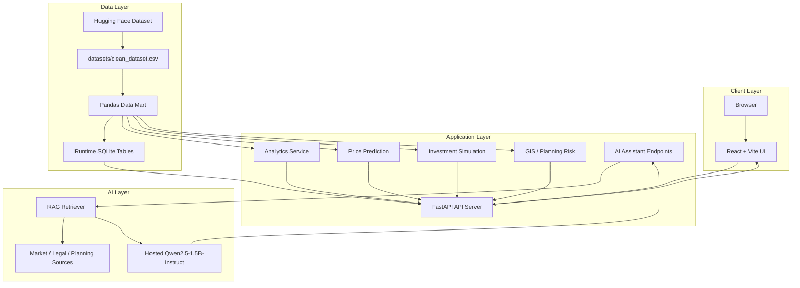
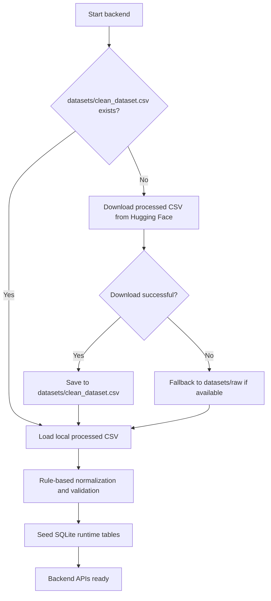
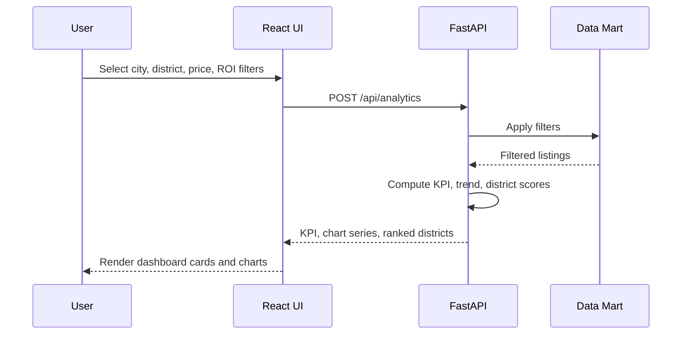
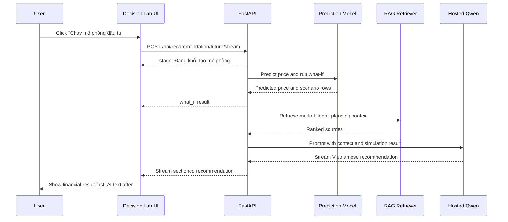
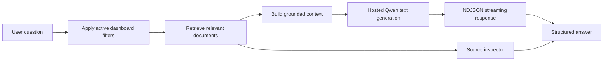
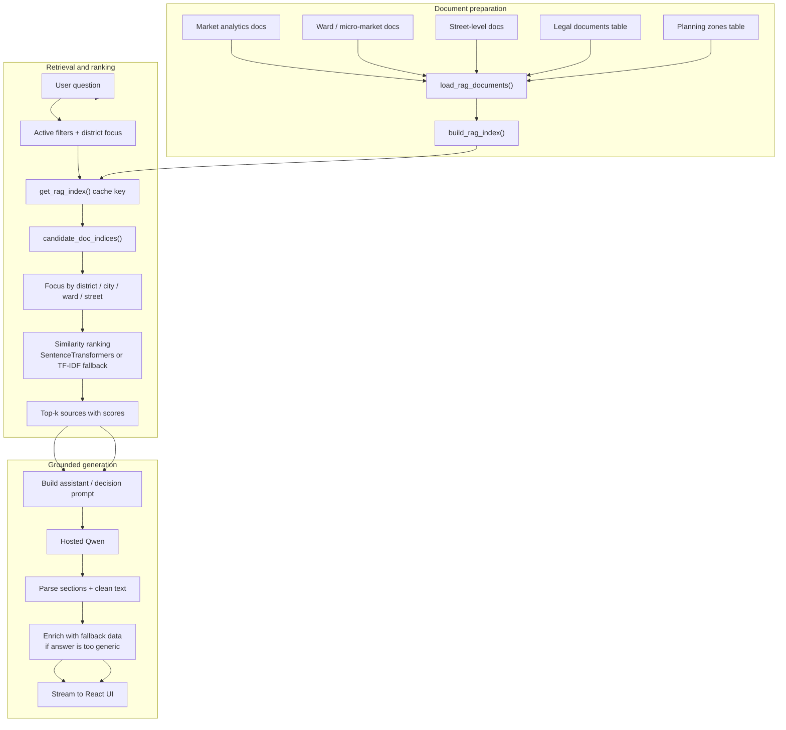
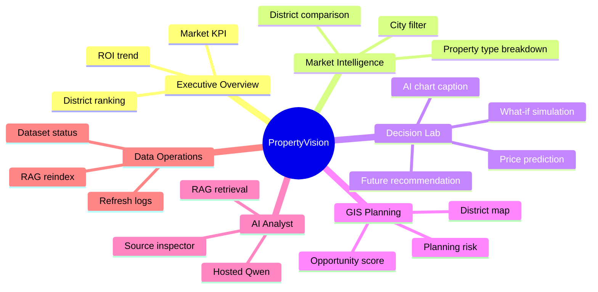

# PropertyVision Project Diagrams

This file contains Mermaid diagrams for README, report writing, and presentation slides.

## 1. System Architecture

## 2. First-Run Dataset Flow

## 3. Dashboard Analytics Flow

## 4. Investment Simulation And AI Recommendation

## 5. RAG Assistant Flow

## 6. RAG Data-to-Answer Flow

Key behaviors:
- The index is rebuilt when data or planning/legal counts change.
- District filters narrow the candidate set before similarity ranking.
- Street-level questions prefer street documents; ward questions prefer micro-market documents.
- If the model response is too generic, the backend enriches it with grounded summary data before returning it.

## 7. Main Feature Map

