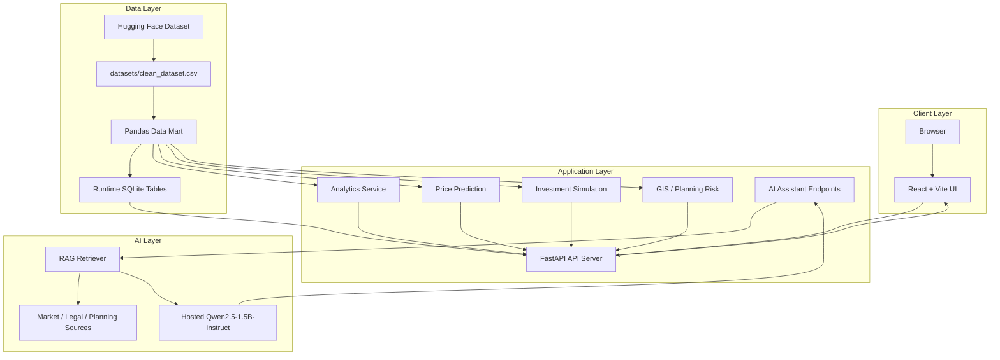
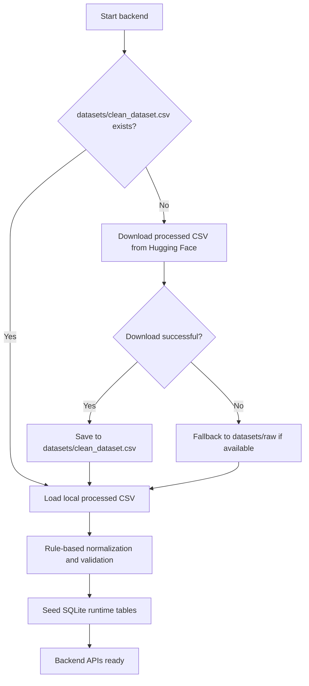
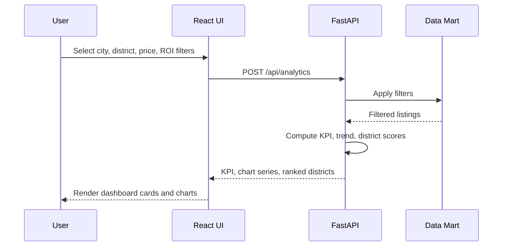
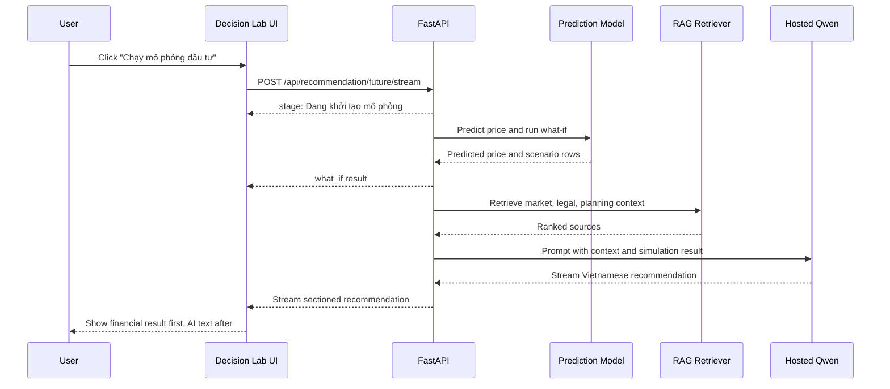
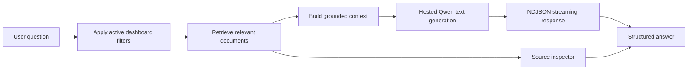
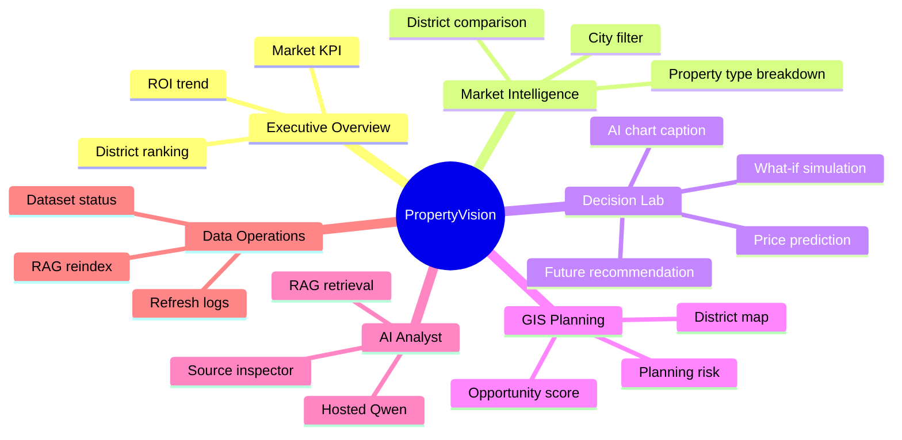

# PropertyVision Project Diagrams

This file contains Mermaid diagrams for README, report writing, and presentation slides.

## 1. System Architecture

## 2. First-Run Dataset Flow

## 3. Dashboard Analytics Flow

## 4. Investment Simulation And AI Recommendation

## 5. RAG Assistant Flow

## 6. Main Feature Map

